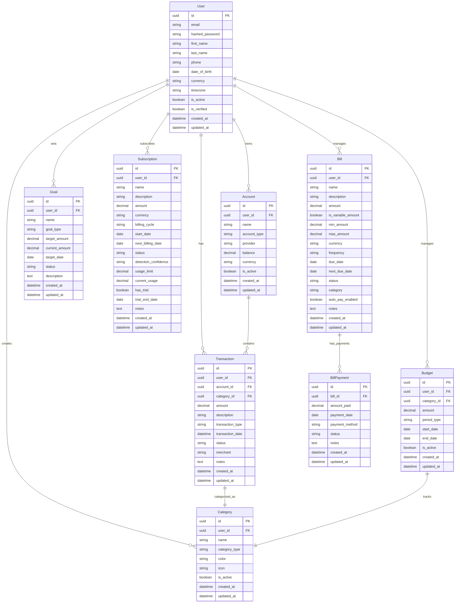
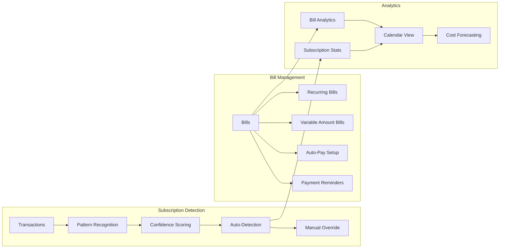
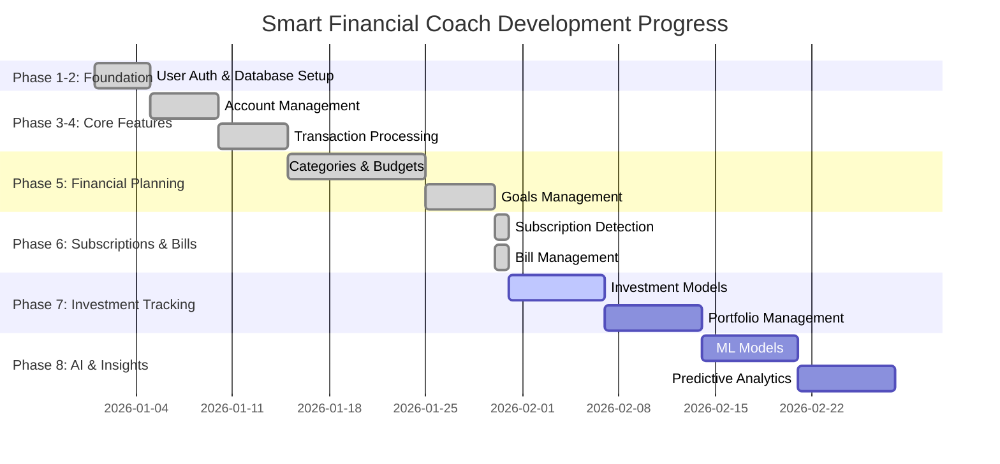

# Smart Financial Coach - System Architecture (Phase 6 Complete)

## Database Schema & Relationships



## API Architecture

```mermaid
graph TB
    Client[Frontend Client] --> API[FastAPI Server :8000]
    
    subgraph "API Layer"
        API --> Auth[Authentication JWT]
        API --> V1[/api/v1/]
        
        V1 --> Users[/users]
        V1 --> Accounts[/accounts]
        V1 --> Transactions[/transactions]
        V1 --> Categories[/categories]
        V1 --> Budgets[/budgets]
        V1 --> Goals[/goals]
        V1 --> Subscriptions[/subscriptions]
        V1 --> Bills[/bills]
    end
    
    subgraph "Service Layer"
        Users --> UserService[User Service]
        Accounts --> AccountService[Account Service]
        Transactions --> TransactionService[Transaction Service]
        Categories --> CategoryService[Category Service]
        Budgets --> BudgetService[Budget Service]
        Goals --> GoalService[Goal Service]
        Subscriptions --> SubscriptionService[Subscription Service]
        Bills --> BillService[Bill Service]
    end
    
    subgraph "Data Layer"
        UserService --> DB[(PostgreSQL Database)]
        AccountService --> DB
        TransactionService --> DB
        CategoryService --> DB
        BudgetService --> DB
        GoalService --> DB
        SubscriptionService --> DB
        BillService --> DB
    end
    
    subgraph "Authentication"
        Auth --> JWT[JWT Tokens]
        Auth --> Hash[Password Hashing]
    end
```

## Subscription & Bill Management Features



## Implementation Phases Status



## API Endpoints Summary

```mermaid
mindmap
  root((Smart Financial Coach API))
    Authentication
      POST /auth/register
      POST /auth/login
      POST /auth/refresh
    
    Users
      GET /users/me
      PUT /users/me
      DELETE /users/me
    
    Accounts
      GET /accounts
      POST /accounts
      GET /accounts/{id}
      PUT /accounts/{id}
      DELETE /accounts/{id}
    
    Transactions
      GET /transactions
      POST /transactions
      GET /transactions/{id}
      PUT /transactions/{id}
      DELETE /transactions/{id}
      POST /transactions/bulk-import
      GET /transactions/export
      GET /transactions/analytics
    
    Categories
      GET /categories
      POST /categories
      GET /categories/{id}
      PUT /categories/{id}
      DELETE /categories/{id}
    
    Budgets
      GET /budgets
      POST /budgets
      GET /budgets/{id}
      PUT /budgets/{id}
      DELETE /budgets/{id}
      GET /budgets/analytics
    
    Goals
      GET /goals
      POST /goals
      GET /goals/{id}
      PUT /goals/{id}
      DELETE /goals/{id}
      GET /goals/analytics
    
    Subscriptions
      GET /subscriptions
      POST /subscriptions
      GET /subscriptions/{id}
      PUT /subscriptions/{id}
      DELETE /subscriptions/{id}
      POST /subscriptions/detect
      GET /subscriptions/analytics
      GET /subscriptions/calendar
      POST /subscriptions/bulk-update
      PUT /subscriptions/{id}/cancel
      PUT /subscriptions/{id}/pause
      PUT /subscriptions/{id}/resume
      GET /subscriptions/upcoming
    
    Bills
      GET /bills
      POST /bills
      GET /bills/{id}
      PUT /bills/{id}
      DELETE /bills/{id}
      GET /bills/upcoming
      GET /bills/overdue
      POST /bills/{id}/payments
      GET /bills/{id}/payments
      PUT /bills/{id}/payments/{payment_id}
      DELETE /bills/{id}/payments/{payment_id}
      PUT /bills/{id}/autopay
      GET /bills/calendar
      GET /bills/analytics
      POST /bills/bulk-update
      GET /bills/{id}/history
      POST /bills/{id}/mark-paid
      PUT /bills/{id}/schedule
      GET /bills/payment-methods
      PUT /bills/{id}/remind
      GET /bills/categories
```

## Current System State (as of Phase 6 Completion)

### ✅ Completed Features
- **User Authentication**: JWT-based auth system
- **Account Management**: Bank account integration ready
- **Transaction Processing**: Full CRUD with analytics
- **Categories & Budgets**: Financial categorization and budget tracking
- **Goals Management**: Financial goal setting and tracking
- **Subscription Detection**: Automated recurring charge detection
- **Bill Management**: Comprehensive bill tracking and payment management

### 🚧 Database Migrations Applied
- `001_initial_schema.py` - Core user and account tables
- `002_add_transactions.py` - Transaction processing
- `003_add_categories.py` - Category management
- `004_add_budgets.py` - Budget tracking
- `005_add_goals.py` - Goal management
- `006_add_subscriptions_and_bills.py` - Subscription and bill tracking

### 📊 API Statistics
- **Total Endpoints**: 50+ endpoints across 8 resource types
- **Authentication**: JWT-based with refresh tokens
- **Validation**: Pydantic schemas for all requests/responses
- **Database**: AsyncSession with PostgreSQL
- **Documentation**: OpenAPI/Swagger auto-generated

### 🔄 Next Phase Ready
- **Phase 7**: Investment Tracking (Weeks 14-15)
  - Investment accounts and portfolios
  - Stock/bond/crypto tracking
  - Performance analytics
  - Diversification insights

## Technical Architecture Notes

### Database Design Principles
- UUID primary keys for security and distributed systems
- Soft deletes with `is_active` flags
- Audit trails with `created_at`/`updated_at`
- Proper foreign key relationships
- Enum types for constrained values

### API Design Patterns
- RESTful endpoints with standard HTTP methods
- Consistent error handling and status codes
- Pagination support for list endpoints
- Bulk operations for efficiency
- Analytics endpoints for insights

### Service Layer Architecture
- Separation of concerns between API and business logic
- Async/await patterns throughout
- Dependency injection for database sessions
- Modular service classes per domain

### Security Considerations
- JWT authentication with expiration
- Password hashing with bcrypt
- Input validation with Pydantic
- SQL injection prevention with SQLAlchemy ORM
- CORS configuration for frontend integration

---

**Generated**: January 31, 2026 - Phase 6 Complete  
**Status**: All core financial management features implemented  
**Next**: Investment tracking and portfolio management (Phase 7)