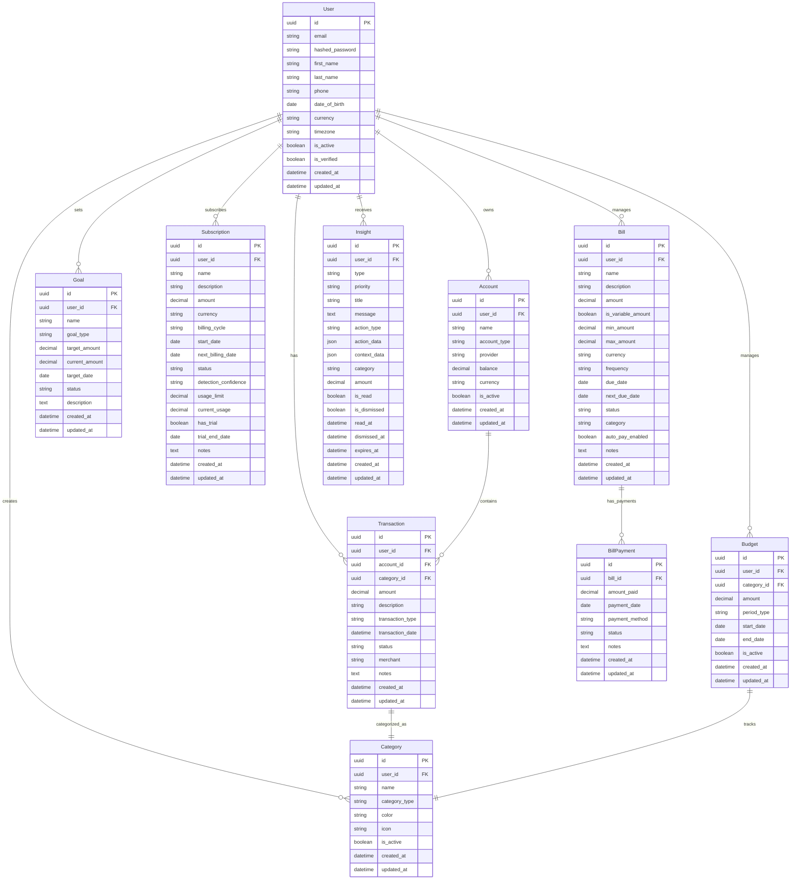
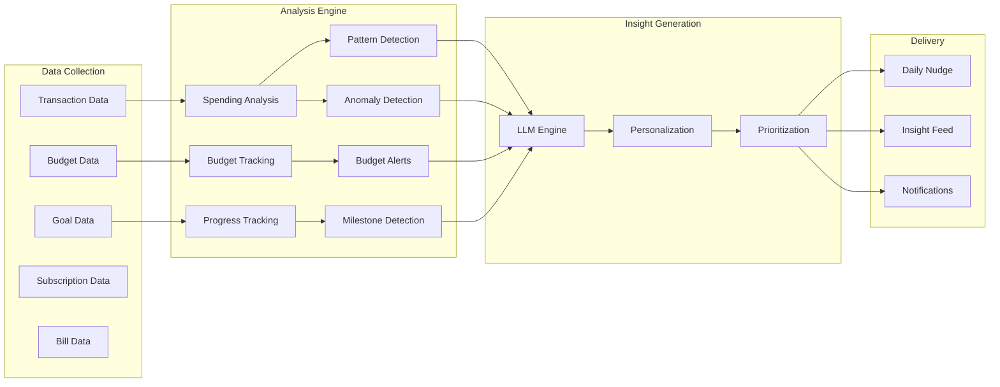
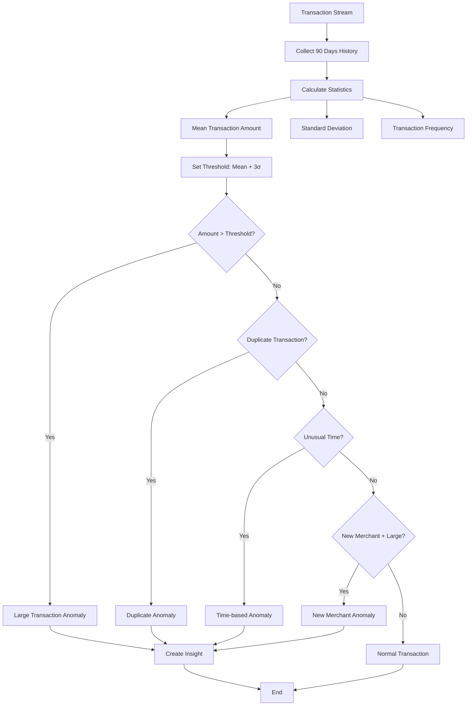
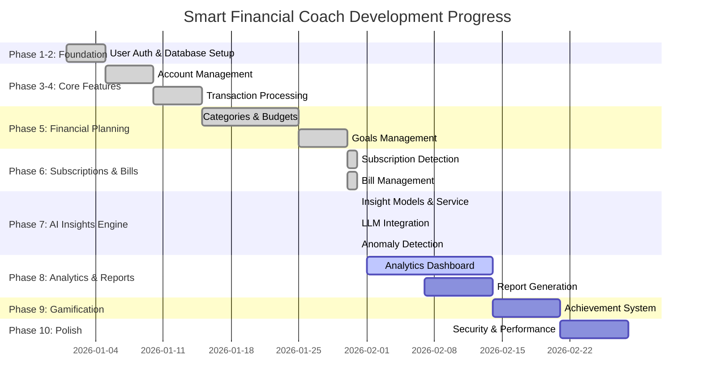

# Smart Financial Coach - System Architecture (Phase 7 Complete)

## Database Schema & Relationships



## API Architecture with AI Insights

```mermaid
graph TB
    Client[Frontend Client] --> API[FastAPI Server :8000]
    
    subgraph "API Layer"
        API --> Auth[Authentication JWT]
        API --> V1[/api/v1/]
        
        V1 --> Users[/users]
        V1 --> Accounts[/accounts]
        V1 --> Transactions[/transactions]
        V1 --> Categories[/categories]
        V1 --> Budgets[/budgets]
        V1 --> Goals[/goals]
        V1 --> Subscriptions[/subscriptions]
        V1 --> Bills[/bills]
        V1 --> Insights[/insights - NEW]
    end
    
    subgraph "Service Layer"
        Users --> UserService[User Service]
        Accounts --> AccountService[Account Service]
        Transactions --> TransactionService[Transaction Service]
        Categories --> CategoryService[Category Service]
        Budgets --> BudgetService[Budget Service]
        Goals --> GoalService[Goal Service]
        Subscriptions --> SubscriptionService[Subscription Service]
        Bills --> BillService[Bill Service]
        Insights --> InsightService[Insight Service - NEW]
    end
    
    subgraph "AI/ML Layer - NEW"
        InsightService --> LLM[LLM Client]
        InsightService --> Anomaly[Anomaly Detection]
        InsightService --> Pattern[Pattern Analysis]
        
        LLM --> OpenAI[OpenAI GPT-4]
        LLM --> Claude[Anthropic Claude]
        LLM --> Gemini[Google Gemini]
        LLM --> Fallback[Fallback Templates]
    end
    
    subgraph "Data Layer"
        UserService --> DB[(PostgreSQL Database)]
        AccountService --> DB
        TransactionService --> DB
        CategoryService --> DB
        BudgetService --> DB
        GoalService --> DB
        SubscriptionService --> DB
        BillService --> DB
        InsightService --> DB
    end
    
    subgraph "Authentication"
        Auth --> JWT[JWT Tokens]
        Auth --> Hash[Password Hashing]
    end
```

## AI Insights System Architecture



## Anomaly Detection Algorithm



## Implementation Phases Status



## API Endpoints Summary (61 Total)

```mermaid
mindmap
  root((Smart Financial Coach API
  61 Endpoints))
    Authentication (3)
      POST /auth/register
      POST /auth/login
      POST /auth/refresh
    
    Users (3)
      GET /users/me
      PUT /users/me
      DELETE /users/me
    
    Accounts (5)
      GET /accounts
      POST /accounts
      GET /accounts/{id}
      PUT /accounts/{id}
      DELETE /accounts/{id}
    
    Transactions (9)
      GET /transactions
      POST /transactions
      GET /transactions/{id}
      PUT /transactions/{id}
      DELETE /transactions/{id}
      POST /transactions/bulk-import
      GET /transactions/export
      GET /transactions/analytics
      POST /transactions/bulk-delete
    
    Categories (5)
      GET /categories
      POST /categories
      GET /categories/{id}
      PUT /categories/{id}
      DELETE /categories/{id}
    
    Budgets (6)
      GET /budgets
      POST /budgets
      GET /budgets/{id}
      PUT /budgets/{id}
      DELETE /budgets/{id}
      GET /budgets/analytics
    
    Goals (6)
      GET /goals
      POST /goals
      GET /goals/{id}
      PUT /goals/{id}
      DELETE /goals/{id}
      GET /goals/analytics
    
    Subscriptions (13)
      GET /subscriptions
      POST /subscriptions
      GET /subscriptions/{id}
      PUT /subscriptions/{id}
      DELETE /subscriptions/{id}
      POST /subscriptions/detect
      GET /subscriptions/analytics
      GET /subscriptions/calendar
      POST /subscriptions/bulk-update
      PUT /subscriptions/{id}/cancel
      PUT /subscriptions/{id}/pause
      PUT /subscriptions/{id}/resume
      GET /subscriptions/upcoming
    
    Bills (20)
      GET /bills
      POST /bills
      GET /bills/{id}
      PUT /bills/{id}
      DELETE /bills/{id}
      GET /bills/upcoming
      GET /bills/overdue
      POST /bills/{id}/payments
      GET /bills/{id}/payments
      PUT /bills/{id}/payments/{payment_id}
      DELETE /bills/{id}/payments/{payment_id}
      PUT /bills/{id}/autopay
      GET /bills/calendar
      GET /bills/analytics
      POST /bills/bulk-update
      GET /bills/{id}/history
      POST /bills/{id}/mark-paid
      PUT /bills/{id}/schedule
      GET /bills/payment-methods
      PUT /bills/{id}/remind
      GET /bills/categories
    
    Insights (8 - NEW)
      GET /insights
      GET /insights/daily
      GET /insights/{id}
      POST /insights/{id}/read
      POST /insights/{id}/dismiss
      POST /insights/generate
      GET /insights/analytics
      POST /insights/detect-anomalies
```

## Phase 7 - AI Insights Engine Features

### ✅ Completed Features

#### 1. **Insight Model & Database**
- Comprehensive Insight model with type, priority, and categorization
- User interaction tracking (read, dismissed, acted upon)
- Insight expiration and scheduling
- Optimized database indexes for querying

#### 2. **LLM Integration**
- Multi-provider support (OpenAI, Anthropic, Gemini)
- Auto-detection of available LLM providers
- Fallback to template-based insights when LLM unavailable
- Configurable models per provider

#### 3. **Insight Generation**
- Daily insight generation pipeline
- Context gathering from transactions, budgets, goals
- Opportunity identification algorithms
- Insight prioritization logic
- LLM-powered personalized messaging

#### 4. **Anomaly Detection** 🆕
- Statistical analysis (mean, standard deviation)
- Detection algorithms:
  - Unusually large transactions (>3σ from mean)
  - Duplicate transactions (same merchant/amount within 24h)
  - Unusual transaction times (2 AM - 5 AM)
  - New merchants with large amounts
- Automatic insight creation from anomalies

#### 5. **Insight Analytics** 🆕
- Total insights generated
- Read and dismiss rates
- Distribution by type and priority
- Recent activity tracking
- Average insights per week

#### 6. **API Endpoints (8 total)**
- List insights with filters
- Get daily nudge
- Get specific insight
- Mark as read
- Dismiss insight
- Manual insight generation
- Analytics endpoint 🆕
- Anomaly detection endpoint 🆕

### 📊 Insight Types Supported
1. **Spending Alert** - Unusual spending increases
2. **Savings Opportunity** - Potential to save money
3. **Goal Progress** - Goal milestones reached
4. **Pattern Detection** - Recurring patterns identified
5. **Celebration** - Positive achievements
6. **Tip** - General financial advice
7. **Anomaly** - Suspicious or unusual transactions
8. **Subscription Warning** - Unused subscriptions detected

### 🎯 Priority Levels
- **URGENT** - Requires immediate attention
- **HIGH** - Important, action recommended soon
- **NORMAL** - Regular insights
- **LOW** - Nice-to-know information

## Current System State (as of Phase 7 Completion)

### ✅ Completed Features
- **User Authentication**: JWT-based auth system
- **Account Management**: Bank account integration ready
- **Transaction Processing**: Full CRUD with analytics
- **Categories & Budgets**: Financial categorization and budget tracking
- **Goals Management**: Financial goal setting and tracking
- **Subscription Detection**: Automated recurring charge detection
- **Bill Management**: Comprehensive bill tracking and payment management
- **AI Insights Engine**: Personalized financial coaching with anomaly detection 🆕

### 🚧 Database Migrations Applied
- `001_initial_schema.py` - Core user and account tables
- `002_add_plaid_tables.py` - Plaid integration
- `003_add_transactions.py` - Transaction processing
- `004_add_insights.py` - AI insights system 🆕
- `005_add_goals.py` - Goal management
- `006_add_subscriptions_and_bills.py` - Subscription and bill tracking

### 📊 API Statistics
- **Total Endpoints**: 61 endpoints across 9 resource types
- **New in Phase 7**: 8 insight endpoints
- **Authentication**: JWT-based with refresh tokens
- **Validation**: Pydantic schemas for all requests/responses
- **Database**: AsyncSession with PostgreSQL
- **AI/ML**: LLM integration with multi-provider support
- **Documentation**: OpenAPI/Swagger auto-generated

### 🔄 Next Phase Ready
- **Phase 8**: Analytics & Reports (Weeks 17-18)
  - Comprehensive analytics dashboard
  - Net worth tracking
  - Period comparison analytics
  - PDF report generation
  - Scheduled report delivery

## Technical Architecture Notes

### AI/ML Integration
- **LLM Providers**: OpenAI GPT-4, Anthropic Claude, Google Gemini
- **Fallback Strategy**: Template-based insights when LLM unavailable
- **Context Management**: Gathers user financial data for personalization
- **Prompt Engineering**: Structured prompts for consistent output
- **Error Handling**: Graceful degradation to fallback mode

### Anomaly Detection Algorithm
- **Statistical Methods**: 
  - Mean and standard deviation calculations
  - 3-sigma threshold for outlier detection
- **Pattern Matching**:
  - Time-based analysis
  - Merchant history tracking
  - Duplicate transaction detection
- **Severity Classification**:
  - High: >1.5x threshold
  - Medium: >threshold, unusual patterns
  - Low: Edge cases, informational

### Insight Generation Pipeline
1. **Context Collection**: Gather transaction, budget, goal data
2. **Opportunity Identification**: Detect patterns and anomalies
3. **Prioritization**: Rank by importance and actionability
4. **Generation**: Create personalized messages via LLM
5. **Delivery**: Store in database, available via API
6. **Tracking**: Monitor user interactions and engagement

### Database Design Principles
- UUID primary keys for security and distributed systems
- Soft deletes with `is_active` flags
- Audit trails with `created_at`/`updated_at`
- Proper foreign key relationships
- Enum types for constrained values
- JSON fields for flexible metadata
- Optimized indexes for common queries

### API Design Patterns
- RESTful endpoints with standard HTTP methods
- Consistent error handling and status codes
- Pagination support for list endpoints
- Bulk operations for efficiency
- Analytics endpoints for insights
- Filter parameters for flexible querying

### Service Layer Architecture
- Separation of concerns between API and business logic
- Async/await patterns throughout
- Dependency injection for database sessions
- Modular service classes per domain
- LLM client abstraction for provider flexibility

### Security Considerations
- JWT authentication with expiration
- Password hashing with bcrypt
- Input validation with Pydantic
- SQL injection prevention with SQLAlchemy ORM
- CORS configuration for frontend integration
- Rate limiting ready for production

---

**Generated**: January 31, 2026 - Phase 7 Complete  
**Status**: AI Insights Engine fully operational with anomaly detection  
**Next**: Analytics & Reports with comprehensive dashboards (Phase 8)  
**LLM Status**: Multi-provider support with fallback templates