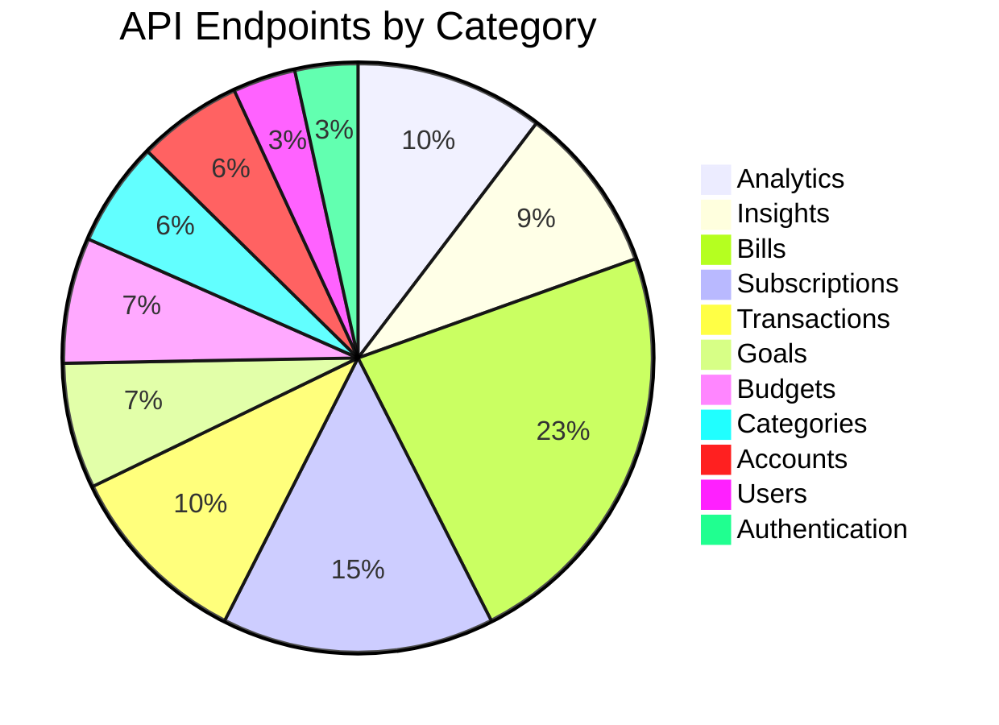
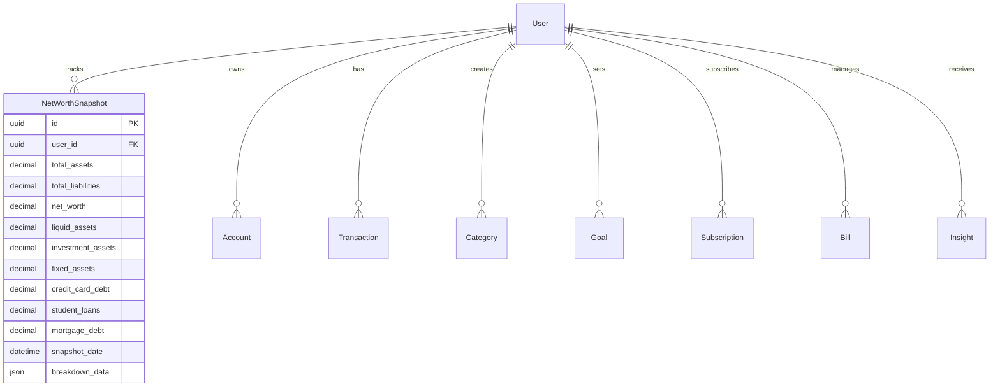
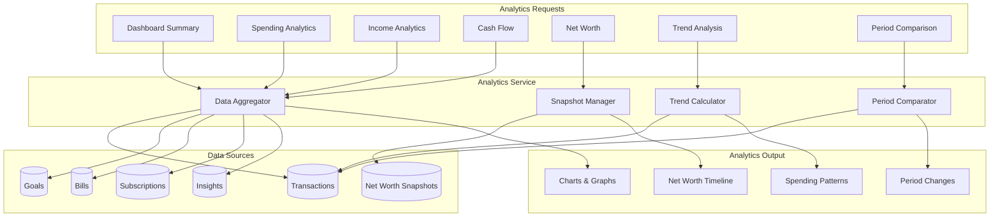
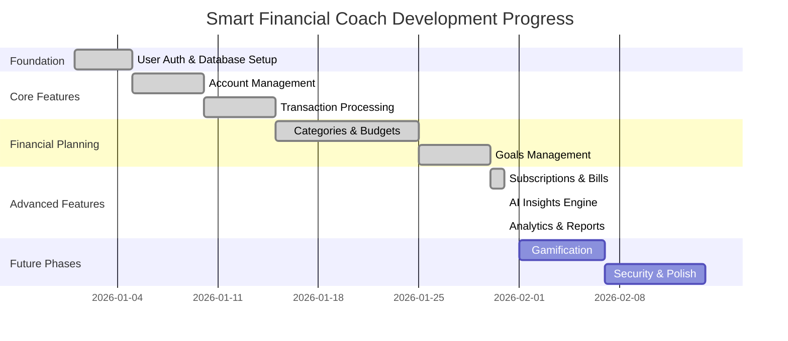

# Smart Financial Coach - System Architecture (Phase 8 Complete)

## Overview
**Current Phase**: Phase 8 - Analytics & Reports ✅  
**Total API Endpoints**: 69  
**Database Migrations Applied**: 7  
**Features**: Complete financial management platform with AI insights and comprehensive analytics

---

## Phase 8 Completion Summary

### ✅ **New Features Implemented**

#### 1. **Dashboard Analytics**
- Comprehensive dashboard summary endpoint
- Current balance and cash flow
- Budget and goal status
- Subscription and bill summaries
- Recent insights tracking

#### 2. **Spending Analytics**
- Total spending by period
- Spending by category breakdown
- Daily spending trends
- Top merchants analysis
- Period-over-period comparison

#### 3. **Income Analytics**
- Income by source tracking
- Income trends over time
- Monthly average calculations
- Year-over-year comparisons

#### 4. **Cash Flow Analysis**
- Income vs expenses tracking
- Net cash flow calculations
- Daily/weekly/monthly breakdowns
- Savings rate calculations

#### 5. **Net Worth Tracking**
- Historical net worth snapshots
- Asset and liability breakdown
- Net worth change tracking
- Debt-to-asset ratio
- Liquid asset ratio

#### 6. **Period Comparisons**
- Week/month/quarter/year comparisons
- Absolute and percentage changes
- Trend identification

#### 7. **Trend Analysis**
- Multi-month spending trends
- Category-wise trend analysis
- Historical pattern visualization

### 📊 **API Endpoints (8 new)**
1. `GET /analytics/dashboard` - Comprehensive dashboard summary
2. `GET /analytics/spending` - Detailed spending analytics
3. `GET /analytics/income` - Income analytics
4. `GET /analytics/cash-flow` - Cash flow analysis
5. `GET /analytics/net-worth` - Net worth history
6. `POST /analytics/net-worth` - Create net worth snapshot
7. `GET /analytics/net-worth/latest` - Latest net worth
8. `GET /analytics/trends/spending` - Multi-period spending trends
9. `GET /analytics/comparison` - Period comparisons

### 🗄️ **Database Updates**
- **Migration 007**: `net_worth_snapshots` table
- Indexes for efficient time-series queries
- Support for detailed asset/liability breakdowns

---

## Complete System Architecture

### API Endpoint Distribution (69 Total)

### Database Schema Evolution

### Analytics Service Architecture

### Implementation Progress

---

## Complete API Endpoint Catalog

### 🔐 Authentication (3)
- POST `/api/v1/auth/register`
- POST `/api/v1/auth/login`
- POST `/api/v1/auth/refresh`

### 👤 Users (3)
- GET `/api/v1/users/me`
- PUT `/api/v1/users/me`
- DELETE `/api/v1/users/me`

### 🏦 Accounts (5)
- GET `/api/v1/accounts`
- POST `/api/v1/accounts`
- GET `/api/v1/accounts/{id}`
- PUT `/api/v1/accounts/{id}`
- DELETE `/api/v1/accounts/{id}`

### 💳 Transactions (9)
- GET `/api/v1/transactions`
- POST `/api/v1/transactions`
- GET `/api/v1/transactions/{id}`
- PUT `/api/v1/transactions/{id}`
- DELETE `/api/v1/transactions/{id}`
- POST `/api/v1/transactions/bulk-import`
- GET `/api/v1/transactions/export`
- GET `/api/v1/transactions/analytics`
- POST `/api/v1/transactions/bulk-delete`

### 📁 Categories (5)
- GET `/api/v1/categories`
- POST `/api/v1/categories`
- GET `/api/v1/categories/{id}`
- PUT `/api/v1/categories/{id}`
- DELETE `/api/v1/categories/{id}`

### 💰 Budgets (6)
- GET `/api/v1/budgets`
- POST `/api/v1/budgets`
- GET `/api/v1/budgets/{id}`
- PUT `/api/v1/budgets/{id}`
- DELETE `/api/v1/budgets/{id}`
- GET `/api/v1/budgets/analytics`

### 🎯 Goals (6)
- GET `/api/v1/goals`
- POST `/api/v1/goals`
- GET `/api/v1/goals/{id}`
- PUT `/api/v1/goals/{id}`
- DELETE `/api/v1/goals/{id}`
- GET `/api/v1/goals/analytics`

### 🔄 Subscriptions (13)
- GET `/api/v1/subscriptions`
- POST `/api/v1/subscriptions`
- GET `/api/v1/subscriptions/{id}`
- PUT `/api/v1/subscriptions/{id}`
- DELETE `/api/v1/subscriptions/{id}`
- POST `/api/v1/subscriptions/detect`
- GET `/api/v1/subscriptions/analytics`
- GET `/api/v1/subscriptions/calendar`
- POST `/api/v1/subscriptions/bulk-update`
- PUT `/api/v1/subscriptions/{id}/cancel`
- PUT `/api/v1/subscriptions/{id}/pause`
- PUT `/api/v1/subscriptions/{id}/resume`
- GET `/api/v1/subscriptions/upcoming`

### 📄 Bills (20)
- GET `/api/v1/bills`
- POST `/api/v1/bills`
- GET `/api/v1/bills/{id}`
- PUT `/api/v1/bills/{id}`
- DELETE `/api/v1/bills/{id}`
- GET `/api/v1/bills/upcoming`
- GET `/api/v1/bills/overdue`
- POST `/api/v1/bills/{id}/payments`
- GET `/api/v1/bills/{id}/payments`
- PUT `/api/v1/bills/{id}/payments/{payment_id}`
- DELETE `/api/v1/bills/{id}/payments/{payment_id}`
- PUT `/api/v1/bills/{id}/autopay`
- GET `/api/v1/bills/calendar`
- GET `/api/v1/bills/analytics`
- POST `/api/v1/bills/bulk-update`
- GET `/api/v1/bills/{id}/history`
- POST `/api/v1/bills/{id}/mark-paid`
- PUT `/api/v1/bills/{id}/schedule`
- GET `/api/v1/bills/payment-methods`
- PUT `/api/v1/bills/{id}/remind`
- GET `/api/v1/bills/categories`

### 💡 Insights (8)
- GET `/api/v1/insights`
- GET `/api/v1/insights/daily`
- GET `/api/v1/insights/{id}`
- POST `/api/v1/insights/{id}/read`
- POST `/api/v1/insights/{id}/dismiss`
- POST `/api/v1/insights/generate`
- GET `/api/v1/insights/analytics`
- POST `/api/v1/insights/detect-anomalies`

### 📊 Analytics (9) 🆕
- GET `/api/v1/analytics/dashboard` 🆕
- GET `/api/v1/analytics/spending` 🆕
- GET `/api/v1/analytics/income` 🆕
- GET `/api/v1/analytics/cash-flow` 🆕
- GET `/api/v1/analytics/net-worth` 🆕
- POST `/api/v1/analytics/net-worth` 🆕
- GET `/api/v1/analytics/net-worth/latest` 🆕
- GET `/api/v1/analytics/trends/spending` 🆕
- GET `/api/v1/analytics/comparison` 🆕

---

## Analytics Features Deep Dive

### Dashboard Summary
Provides a comprehensive overview including:
- Current account balance
- Monthly income and spending
- Net cash flow and savings rate
- Active budgets and goals status
- Upcoming bills and subscription costs
- Recent insights and alerts
- Net worth and change over time

### Spending Analytics
- **Category Breakdown**: See where money is going
- **Merchant Analysis**: Identify top spending merchants
- **Daily Trends**: Visualize daily spending patterns
- **Comparisons**: Compare with previous periods
- **Averages**: Daily/weekly/monthly spending averages

### Income Analytics
- **Source Tracking**: Income by source (salary, freelance, investments)
- **Trend Analysis**: Income trends over time
- **Monthly Projections**: Forecast based on historical data
- **Growth Tracking**: Year-over-year income growth

### Cash Flow
- **Income vs Expenses**: Clear visualization of cash flow
- **Net Cash Flow**: Calculate surplus or deficit
- **Savings Rate**: Track percentage of income saved
- **Period Analysis**: Daily, weekly, monthly breakdowns

### Net Worth Tracking
- **Historical Snapshots**: Track net worth over time
- **Asset Breakdown**: Liquid, investment, fixed assets
- **Liability Tracking**: All debt categories
- **Key Ratios**: Debt-to-asset, liquid asset ratio
- **Change Tracking**: Monitor net worth growth

---

## Technical Implementation

### Analytics Service Features
- **Async Operations**: Non-blocking database queries
- **Efficient Aggregation**: Optimized SQL queries
- **Period Calculations**: Flexible date range support
- **Comparison Logic**: Automatic previous period calculations
- **Data Caching**: Ready for Redis caching (future enhancement)

### Database Optimization
- **Indexes**: Efficient querying on user_id + snapshot_date
- **Time-Series Data**: Optimized for historical queries
- **JSON Storage**: Flexible breakdown data storage
- **Decimal Precision**: Accurate financial calculations

### API Design
- **RESTful**: Standard HTTP methods
- **Query Parameters**: Flexible filtering and date ranges
- **Response Models**: Pydantic validation
- **Error Handling**: Clear error messages
- **Documentation**: Auto-generated OpenAPI/Swagger docs

---

## System Status

### ✅ Completed Phases (1-8)
- ✅ Phase 1-2: User Authentication & Database
- ✅ Phase 3: Account Management
- ✅ Phase 4: Transaction Processing
- ✅ Phase 5: Categories, Budgets & Goals
- ✅ Phase 6: Subscriptions & Bills
- ✅ Phase 7: AI Insights Engine
- ✅ Phase 8: Analytics & Reports

### 🔄 Next Phases
- **Phase 9**: Gamification & Engagement
  - Achievement system
  - XP and leveling
  - Streak tracking
  - Challenge system
  - Leaderboards

- **Phase 10**: Polish & Security
  - Security audit
  - Performance optimization
  - Accessibility improvements
  - Production hardening

### 📈 Statistics
- **Total Endpoints**: 69
- **Database Tables**: 12+
- **Migrations Applied**: 7
- **AI Integration**: Gemini (Google AI)
- **Features**: 8 major feature areas

---

**Generated**: January 31, 2026 - Phase 8 Complete  
**Status**: Analytics & reporting fully operational  
**Next**: Gamification & engagement features (Phase 9)